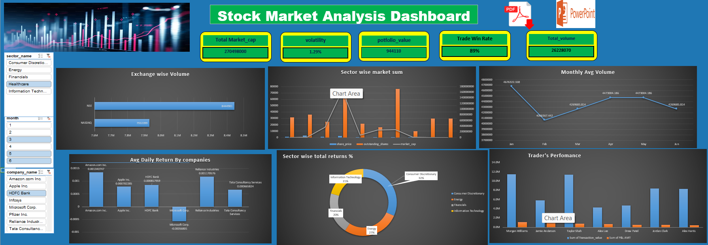
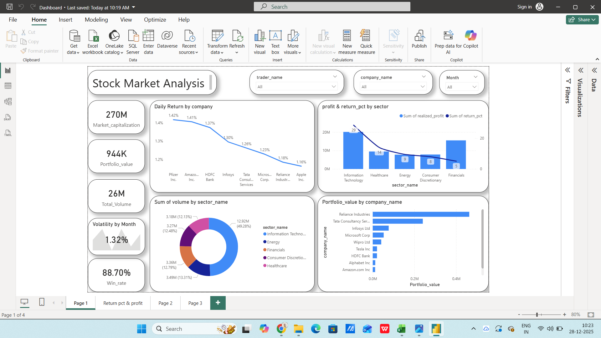
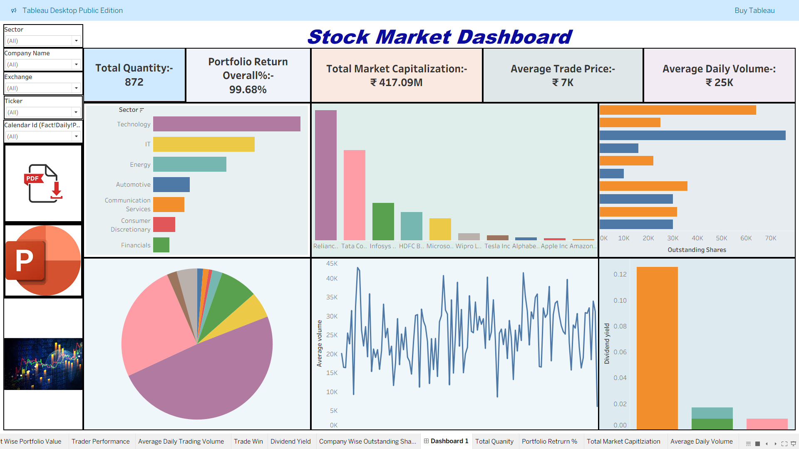

# 📈 Stock Market Performance & Financial Analytics Dashboard

# 📌 Project Overview
This project presents a comprehensive stock market analytics dashboard designed to analyze financial market trends, portfolio performance, trading activity, and investment risk indicators.

The dashboard transforms raw stock market data into actionable financial insights that support:

* Investment analysis
* Portfolio monitoring
* Risk assessment
* Market trend tracking
* Executive financial reporting

---

# 🎯 Business Problem

Financial analysts and investors generate large volumes of market and trading data but often struggle to:

* Monitor stock performance efficiently
* Analyze market volatility
* Track portfolio returns
* Identify sector performance trends
* Evaluate investment risks

This project addresses these challenges using interactive dashboards and KPI-driven financial analytics.

---

# 🚀 Project Objectives

The primary objectives of this dashboard are to:

✔ Analyze stock market performance trends
✔ Monitor portfolio returns and volatility
✔ Track trading activity and investment KPIs
✔ Compare sector-wise financial performance
✔ Identify bullish and bearish market patterns
✔ Support data-driven investment decisions

---

# 🛠 Tech Stack

| Tool     | Purpose                                               |
| -------- | ----------------------------------------------------- |
| SQL      | Data Querying, KPI Analysis & Financial Insights      |
| Tableau  | Interactive Dashboard Development & Visualization     |
| Power BI | Executive Financial Reporting & Business Intelligence |
| Excel    | Data Cleaning, Validation & Initial Analysis          |

---

# 📊 Key Performance Indicators (KPIs)

| KPI                   | Description                  |
| --------------------- | ---------------------------- |
| Portfolio Return      | Overall investment return    |
| Daily Trading Volume  | Total trading activity       |
| ROI Percentage        | Investment profitability     |
| Moving Average        | Trend analysis indicator     |
| Market Volatility     | Risk measurement             |
| Sector Performance    | Industry-wise stock analysis |
| Sharpe Ratio          | Risk-adjusted return         |
| Market Capitalization | Company valuation analysis   |

---

# 📈 Dashboard Features

## 📉 Market Performance Analytics

* Stock price trend analysis
* Market index tracking
* Sector-wise performance comparison
* Historical performance analysis

---

## 💼 Portfolio Analytics

* Portfolio return monitoring
* Investment allocation analysis
* Risk-return comparison
* Profitability tracking

---

## 📊 Trading Activity Insights

* Daily trading volume analysis
* Price movement tracking
* Bullish vs bearish trend analysis
* Volatility monitoring

---

## 🎛 Interactive Dashboard Filters

* Company
* Sector
* Market Index
* Date Range
* Stock Category
* Trading Period

---

# 🧠 Key Business Insights

📌 Technology sector stocks demonstrated the highest long-term growth performance.

📌 High-volatility stocks carried significantly greater short-term investment risk.

📌 Diversified portfolios outperformed concentrated sector investments over time.

📌 Major market announcements triggered substantial spikes in trading activity.

📌 Large-cap stocks showed comparatively lower volatility and stable returns.

---

# 💡 Business Recommendations

✔ Diversify investment portfolios to reduce risk exposure
✔ Monitor volatility indicators before high-risk investments
✔ Focus on long-term growth sectors with stable performance
✔ Use market trend analysis for strategic investment planning
✔ Implement continuous portfolio performance monitoring

---

# 🖥 Dashboard Preview





---

# 🔄 Project Workflow

Raw Stock Market Dataset
            ↓
Data Cleaning & Validation
            ↓
SQL Querying & KPI Extraction
            ↓
Dashboard Development in Tableau & Power BI
            ↓
Financial Insights & Investment Recommendations
```

---

# 📂 Repository Structure
Stock-Market-Performance-Analytics-Dashboard/
│
├── data/
├── excel-files/
├── sql/
├── tableau-dashboard/
├── powerbi-dashboard/
├── images/
├── README.md
├── stockmarket-dashboard.pbix
└── stockmarket-dashboard.twbx
```

---

# 🌟 Project Highlights

✅ Executive-Level Tableau & Power BI Dashboard
✅ Real-World Financial Analytics Use Case
✅ Interactive KPI Reporting & Visualization
✅ Portfolio & Market Performance Analytics
✅ SQL-Based Financial Insights & KPI Analysis
✅ Excel-Based Data Cleaning & Validation
✅ Business Intelligence Storytelling

---

# 🏆 Skills Demonstrated

| Category              | Skills                      |
| --------------------- | --------------------------- |
| Business Intelligence | Tableau, Power BI           |
| Financial Analytics   | Portfolio & Market Analysis |
| Data Analysis         | SQL, KPI Reporting          |
| Data Cleaning         | Excel                       |
| Dashboarding          | Interactive Visualization   |
| Domain Knowledge      | Stock Market Analytics      |

---

# 🏆 Project Value

This project demonstrates:

* Financial analytics expertise
* Business intelligence reporting
* KPI-driven dashboarding
* Investment performance analysis
* Executive storytelling
* Multi-tool analytics workflow

---

# 📬 Connect With Me

## 👤 Vishal Singh

* LinkedIn: [https://linkedin.com/in/vishal-singhdataanalyst](https://linkedin.com/in/vishal-singhdataanalyst)
* GitHub: [https://github.com/vishaaaal15](https://github.com/vishaaaal15)

